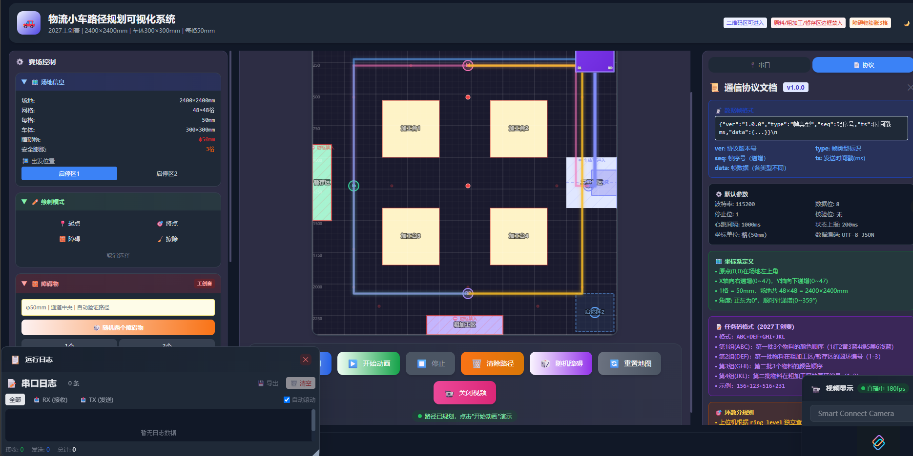

# 物流小车路径规划可视化系统 · 2027工创赛智能+

> **PC 端路径规划与可视化系统** — 基于 Canvas 的实时地图渲染 + A* 路径规划算法 + 串口通信，用于 2027 年中国大学生工程实践与创新能力大赛「智能+」命题物流小车赛项。

[](https://www.typescriptlang.org/)
[](https://react.dev/)
[](https://vitejs.dev/)
[](https://tailwindcss.com/)
[](LICENSE)
[](CONTRIBUTING.md)

---

## 🖼️ 界面预览



> 深色主题下的完整界面：控制面板（左）+ Canvas 地图（中）+ 串口/协议面板（右）+ 浮动日志/视频面板（下）

---

## ✨ 功能一览

| 功能 | 说明 |
|------|------|
| 🗺️ **48×48 格栅地图** | Canvas 高精度绘制，支持缩放与 HiDPI |
| 🚗 **实时小车渲染** | 麦轮、车头方向、转速显示、坐标标注 |
| 🧭 **A\* 路径规划** | 单段 / 8 段比赛流程规划，支持膨胀安全半径 |
| 🎨 **分段彩色路径** | 8 段赛程用不同颜色区分，激活段高亮 |
| 🟦 **启停区高亮** | 选中启停区时地图区域高亮，车体位置精确对齐 |
| 🧱 **动态障碍物** | 可增删障碍物，自动验证所有关键路段可达性 |
| 🔌 **串口通信** | Web Serial API，实时上报位置与状态 |
| 🌓 **深色/浅色主题** | 一键切换 + 跟随系统 |
| 📊 **性能监控** | 实时 FPS、平均帧率、最低帧率 |
| 📋 **协议日志面板** | 可拖拽浮动日志面板，实时查看通信数据 |
| 🎥 **视频预览** | 可选视频面板，支持摄像头画面叠加 |

---

## 🚀 快速开始

### 在线体验

```bash
# 克隆项目
git clone https://github.com/FahuWWWWWWW/Logistics-Cart-Path-Planning-Visualization-System.git

# 进入目录
cd Logistics-Cart-Path-Planning-Visualization-System

# 安装依赖
npm install

# 启动开发服务器
npm run dev
```

访问 `http://localhost:3000`（默认端口）。

### 生产构建

```bash
# 构建生产版本
npm run build

# 预览构建结果
npm run preview
```

### 离线使用（Windows）

项目提供多种离线启动方式，放在 `tools/` 目录：

| 文件 | 说明 | 使用场景 |
|------|------|----------|
| `tools/一键启动.vbs` | 静默启动，无界面 | **推荐日常使用** |
| `tools/启动器.hta` | 图形化启动器，可查看状态 | 需要查看日志时 |
| `tools/启动.bat` | 命令行启动 | 调试排查 |

**使用步骤**：

1. 双击 `tools/一键启动.vbs`
2. 等待几秒，浏览器自动打开
3. 使用完毕，双击 `tools/停止.vbs` 关闭服务器

> 💡 **提示**：首次使用需要运行 `npm run build` 生成 `dist/` 目录。

---

## 🍓 树莓派部署

项目支持在树莓派上运行，详细文档见 [`docs/README-RaspberryPi.md`](docs/README-RaspberryPi.md)。

### 快速部署

```bash
# 1. 克隆项目
git clone https://github.com/FahuWWWWWWW/Logistics-Cart-Path-Planning-Visualization-System.git
cd Logistics-Cart-Path-Planning-Visualization-System

# 2. 赋予脚本执行权限
chmod +x scripts/*.sh

# 3. 一键部署（自动安装依赖、构建、启动）
./scripts/deploy-rpi.sh
```

### 日常使用

```bash
# 快速启动
./scripts/start-rpi.sh

# 停止服务器
./scripts/stop-rpi.sh
```

### 串口权限配置

```bash
# 将当前用户加入 dialout 组（串口访问权限）
sudo usermod -a -G dialout $USER

# 重启后生效
sudo reboot
```

> ⚠️ **注意**：Web Serial API 只能在 `localhost` 下使用，远程访问时无法使用串口（浏览器安全限制）。

---

## 🏟️ 场地规格（2027 工创赛标准）

| 元素 | 实际尺寸 | 网格尺寸 | 位置描述 |
|------|---------|---------|----------|
| 比赛场地 | 2400×2400mm | 48×48 格 | 每格 50×50mm |
| 智能小车 | 300×300mm | 6×6 格 | 安全膨胀半径 150mm（3 格） |
| 启停区 ×2 | 300×300mm | 6×6 格 | 右上角 (44,3)、右下角 (44,44) |
| 加工台 ×4 | 450×450mm | 9×9 格 | 四角分布（中央留十字通道） |
| 二维码区 | 400×1400mm | 8×28 格 | 右侧纵向区域（车体可驶入） |
| 原料区 | 400×200mm | 6×2 格 | 顶部中央（含 φ300mm 转盘） |
| 暂存区 | 200×1000mm | 3×12 格 | 左侧垂直居中 |
| 粗加工区 | 600×200mm | 12×3 格 | 底部中央 |
| 障碍物 | φ50×100mm | 1 格 | 通道中央候选位置 |

---

## 🏁 比赛流程（8 段路径）

```
启停区 ─→ 二维码区 ─→ 原料区 ─→ 粗加工区 ─→ 暂存区
  ↑                                                │
  └────────────────────────────────────────────────┘
                    重复第 2 轮
```

| 步骤 | 路径 | 动作 |
|------|------|------|
| ① | 启停区→二维码区 | 读取任务码 |
| ② | 二维码区→原料区 | 抓取第一批物料 |
| ③ | 原料区→粗加工区 | 运送第一批物料 |
| ④ | 粗加工区→暂存区 | 转运第一批物料 |
| ⑤ | 暂存区→原料区 | 抓取第二批物料 |
| ⑥ | 原料区→粗加工区 | 运送第二批物料 |
| ⑦ | 粗加工区→暂存区 | 码垛第二批物料 |
| ⑧ | 暂存区→启停区 | 完成任务返回 |

---

## 🧠 技术架构

### 前端栈

- **React 19** + **TypeScript 5.7**
- **Vite 6** 构建工具
- **Canvas 2D API** 地图渲染
- **Tailwind CSS 3** 界面样式
- **Web Serial API** 串口通信

### 路径规划（`src/utils/astar.ts`）

- **A\* 算法**：曼哈顿距离启发式，支持对角线穿墙检测
- **网格膨胀**：小车 300×300mm 映射为 3 格安全半径
- **三级鲁棒回退**：直接规划 → 调整终点 → 调整起点+终点
- **螺旋搜索**：`findNearestPassableCell()` 找最近可达点
- **障碍物验证**：自动验证所有关键路径点之间的可达性

### 项目结构

```
Logistics-Cart-Path-Planning-Visualization-System/
├── src/                          # 源代码
│   ├── App.tsx                   # 主应用（状态管理 + 逻辑编排）
│   ├── components/               # React 组件
│   │   ├── GridMap.tsx          # Canvas 网格地图引擎
│   │   ├── ControlPanel.tsx     # 控制面板（起点选择、路径规划、比赛步骤）
│   │   ├── SerialPanel.tsx      # 串口通信面板
│   │   ├── ProtocolPanel.tsx    # 协议收发面板
│   │   ├── LogPanel.tsx         # 运行日志面板
│   │   ├── FloatingPanel.tsx    # 可拖拽浮动面板容器
│   │   ├── FloatingLogPanel.tsx # 浮动日志面板
│   │   ├── VideoPanel.tsx       # 视频预览面板
│   │   └── FPSMonitor.tsx      # 性能监控浮窗
│   ├── utils/                   # 工具函数
│   │   ├── astar.ts            # A* 算法 + 膨胀 + 鲁棒规划
│   │   ├── serial.ts           # Web Serial API 封装
│   │   └── taskCode.ts        # 任务码解析与评分
│   ├── types/                   # TypeScript 类型定义
│   │   └── index.ts
│   └── index.css               # 全局样式 + 微交互动画
├── public/                       # 静态资源
├── docs/                        # 文档
│   ├── learning/               # 学习文档（适合 0 基础）
│   │   ├── 01-前端开发零基础入门.md
│   │   ├── 02-React+TypeScript实战指南.md
│   │   ├── 03-串口通信与Web Serial API入门.md
│   │   ├── 04-路径规划算法(AStar)入门.md
│   │   ├── 05-Canvas API详解与地图绘制实战.md
│   │   ├── 06-Tailwind CSS快速入门.md
│   │   └── 07-Git版本控制入门.md
│   └── README-RaspberryPi.md  # 树莓派部署文档
├── tools/                       # Windows 启动工具
│   ├── 一键启动.vbs            # 静默启动脚本
│   ├── 启动器.hta              # 图形化启动器
│   ├── 启动.bat                # 命令行启动
│   ├── 停止.vbs                # 停止脚本
│   └── README.md               # 使用说明
├── scripts/                     # 部署脚本
│   ├── deploy-rpi.sh           # 树莓派部署脚本
│   ├── start-rpi.sh            # 启动脚本
│   └── stop-rpi.sh            # 停止脚本
├── server.cjs                   # Node.js 静态文件服务器
├── dist/                       # 构建输出（git ignored）
├── README.md                    # 项目说明
├── LICENSE                      # MIT 许可证
├── package.json                 # 项目配置
├── tsconfig.json                # TypeScript 配置
├── vite.config.ts               # Vite 配置
└── tailwind.config.js           # Tailwind 配置
```

---

## 🔌 串口通信协议

上位机与下位机之间通过 **JSON 文本协议** 通信，每帧以 `\n` 结尾。

### 通用帧格式

```json
{"ver":"1.0.0","type":"FRAME_TYPE","seq":1,"ts":1000,"data":{...}}
```

| 字段 | 类型 | 说明 |
|------|------|------|
| `ver` | string | 协议版本号，当前为 `1.0.0` |
| `type` | string | 帧类型（见下方帧类型表） |
| `seq` | number | 帧序号，每发送一帧递增 |
| `ts` | number | 发送时时间戳（ms） |
| `data` | object | 帧数据负载，各帧类型不同 |

### 上位机 → 下位机（发送帧）

| 帧类型 `type` | 说明 | `data` 关键字段 |
|---------------|------|----------------|
| `START` | 启动指令 | `parking`: 1\|2，`task_mode`: auto/manual |
| `SET_TARGET` | 设置目标坐标 | `x`, `y`，可选 `zone` |
| `SET_PATH` | 下发规划路径 | `path`: 坐标数组，`step_index`，`step_name` |
| `REQ_PATH` | 请求下位机规划 | `start`，`end`，`obstacles` |
| `SET_OBSTACLES` | 设置障碍物 | `obs`: 坐标数组，`count`，`diameter_mm` |
| `REQ_STATUS` | 请求状态上报 | （无附加数据） |
| `EMERGENCY_STOP` | 紧急停止 | （无附加数据） |
| `SET_SPEED` | 设置速度 | `speed`(mm/s)，`turn_speed`(°/s) |
| `HEARTBEAT` | 心跳包（1s 周期） | （无附加数据） |
| `QR_READ` | 指令读取二维码 | `parking_zone`: 1\|2 |
| `GRAB` | 抓取物料 | `material_id`，`color`，`from_zone` |
| `PLACE` | 放置物料 | `material_id`，`color`，`to_zone`，`slot`，`is_stack` |
| `SET_PARKING` | 设置启停区 | `parking`: 1\|2，`x`，`y` |
| `RESET` | 复位指令 | （无附加数据） |
| `SET_TASK` | 设置任务参数 | `task_id`，`colors`[]，`order`[] |

**示例：设置目标坐标**
```json
{"ver":"1.0.0","type":"SET_TARGET","seq":2,"ts":2000,"data":{"x":44,"y":24,"zone":"qrcode"}}
```

**示例：启动指令**
```json
{"ver":"1.0.0","type":"START","seq":1,"ts":1000,"data":{"parking":1,"task_mode":"auto"}}
```

**示例：紧急停止**
```json
{"ver":"1.0.0","type":"EMERGENCY_STOP","seq":7,"ts":7000,"data":{}}
```

### 下位机 → 上位机（接收帧）

| 帧类型 `type` | 说明 | `data` 关键字段 |
|---------------|------|----------------|
| `STATUS` | 状态上报（200ms 周期） | `x`, `y`, `angle`, `speed`, `status`, `step`, `uptime` |
| `OBSTACLE` | 障碍物检测上报 | `obs`[]，`source`，`confidence` |
| `PATH_RESULT` | 下位机规划结果 | `path`[]，`length_mm`，`node_count`，`time_cost` |
| `QR_TASK` | 二维码任务内容 | `task_id`，`colors`[]，`batch1_order`[]，`batch2_order`[] |
| `TASK_CODE` | 任务码原始内容 | `raw`: 如 `"156+123+516+231"`，`source` |
| `GRABBED` | 抓取成功上报（新版） | `batch`，`material_idx`，`color_id`，`success` |
| `PLACED` | 放置成功上报（新版） | `batch`，`ring_level`，`ring_score`，`color_id`，`success` |
| `GRAB_RESULT` | 抓取结果（旧版兼容） | `success`，`material_id`，`color`，`confidence` |
| `PLACE_RESULT` | 放置结果（旧版兼容） | `success`，`zone`，`slot`，`score` |
| `ACK` | 通用应答 | `req_seq`，`req_type`，`result`: ok/fail |
| `HEARTBEAT_ACK` | 心跳应答 | （无附加数据） |
| `ERROR` | 错误上报 | `code`，`msg`，`detail` |
| `ARRIVED` | 到达目标通知 | `x`，`y`，`zone`，`step` |
| `BATTERY` | 电池状态 | `voltage`，`percentage`，`is_charging` |
| `SENSOR_DATA` | 传感器原始数据 | `lidar`[]，`ir_front`，`ir_left`，`ir_right` |

**示例：状态上报**
```json
{"ver":"1.0.0","type":"STATUS","seq":1,"ts":1000,"data":{"x":24.5,"y":15.0,"angle":90,"speed":500,"status":"moving","step":2,"uptime":5000}}
```

**示例：错误上报**
```json
{"ver":"1.0.0","type":"ERROR","seq":9,"ts":9000,"data":{"code":101,"msg":"路径规划失败","detail":"目标不可达"}}
```

> 📋 **完整协议定义**见源代码 [`src/types/index.ts`](src/types/index.ts) 中的 `PROTOCOL_DESC` 常量，包含每个帧类型的字段说明和示例。

---

## 🖥️ 界面布局

```
┌─────────────┬──────────────────┬──────────────┐
│  控制面板    │    地图区域      │  串口/协议   │
│  ─────────  │  ─────────────  │  ──────────  │
│ · 启停区选择 │  Canvas 渲染    │ · 串口连接   │
│ · 路径规划   │  48×48 格栅     │ · 协议收发   │
│ · 障碍物设置 │  彩色分段路径   │ · 协议详情   │
│ · 比赛步骤   │  实时小车动画   │              │
│ · 统计数据   │                 │              │
├─────────────┴──────────────────┴──────────────┤
│             可拖拽浮动面板                      │
│  日志面板  ·  视频面板                          │
└───────────────────────────────────────────────┘
```

三列独立滚动，左右面板可折叠，日志和视频支持浮动拖拽。

---

## 📚 学习资源（0 基础入门）

本项目提供完整的学习文档，适合 **0 基础小白** 从零开始学习前端开发。

👉 **[前往 `docs/learning/` 目录阅读所有学习文档](docs/learning/)**

### 学习路径

**第一阶段：基础入门**

1. [前端开发零基础入门](docs/learning/01-前端开发零基础入门.md) — HTML/CSS/JavaScript 基础
2. [Tailwind CSS 快速入门](docs/learning/06-Tailwind%20CSS快速入门.md) — 样式开发
3. [Git 版本控制入门](docs/learning/07-Git版本控制入门.md) — 代码管理

**第二阶段：框架实战**

4. [React+TypeScript 实战指南](docs/learning/02-React+TypeScript实战指南.md) — React 和 TypeScript
5. [Canvas API 详解与地图绘制实战](docs/learning/05-Canvas%20API详解与地图绘制实战.md) — 地图绘制核心

**第三阶段：高级主题**

6. [串口通信与 Web Serial API 入门](docs/learning/03-串口通信与Web%20Serial%20API入门.md) — 硬件交互
7. [路径规划算法(AStar)入门](docs/learning/04-路径规划算法(AStar)入门.md) — 算法原理

---

## 🛠️ 开发指南

### 环境要求

- Node.js ≥ 18
- npm ≥ 9

### 开发命令

```bash
# 安装依赖
npm install

# 启动开发服务器（热更新）
npm run dev

# 类型检查
npx tsc --noEmit

# 构建生产版本
npm run build

# 预览构建结果
npm run preview
```

### 代码规范

- 使用 TypeScript 进行类型检查
- 提交信息遵循 [Conventional Commits](https://www.conventionalcommits.org/) 规范：
  - `feat:` 新功能
  - `fix:` 修复 bug
  - `docs:` 文档修改
  - `style:` 代码格式（不影响功能）
  - `refactor:` 重构
  - `test:` 测试相关

---

## 🤝 贡献指南

欢迎贡献！请阅读 [贡献指南](CONTRIBUTING.md) 了解详情。

### 贡献步骤

1. Fork 本项目
2. 创建功能分支 (`git checkout -b feature/AmazingFeature`)
3. 提交更改 (`git commit -m 'feat: 添加 AmazingFeature'`)
4. 推送到分支 (`git push origin feature/AmazingFeature`)
5. 创建 Pull Request

---

## 🐛 问题排查

### 常见问题

**Q: `npm install` 失败**
- 检查 Node.js 版本是否 ≥ 18
- 尝试清除缓存：`npm cache clean --force`

**Q: 启动后页面空白**
- 检查 `dist/` 目录是否存在
- 运行 `npm run build` 重新构建

**Q: 串口无法连接**
- 确认浏览器支持 Web Serial API（Chrome/Edge 89+）
- 确认小车通过串口正确连接
- 检查用户是否有权限访问串口（Linux/macOS）

**Q: 树莓派上无法启动**
- 确认已安装 Chromium 浏览器
- 检查脚本是否有执行权限（`chmod +x scripts/*.sh`）
- 查看日志：`cat server.log`

---

## 📝 更新日志

详见 [CHANGELOG.md](CHANGELOG.md)。

---

## 📄 许可证

MIT © 2026 FahuWWWWWWW

---

## 🙏 致谢

- [React](https://react.dev/) — UI 框架
- [Vite](https://vitejs.dev/) — 构建工具
- [Tailwind CSS](https://tailwindcss.com/) — 样式框架
- [Canvas API](https://developer.mozilla.org/zh-CN/docs/Web/API/Canvas_API) — 地图渲染

---

## 📧 联系方式

- GitHub Issues: [提交问题](https://github.com/FahuWWWWWWW/Logistics-Cart-Path-Planning-Visualization-System/issues)
- Email: fahu.041216@gmail.com

---

<p align="center">
  ⭐ 如果这个项目对你有帮助，请给它一个 Star！
</p>
